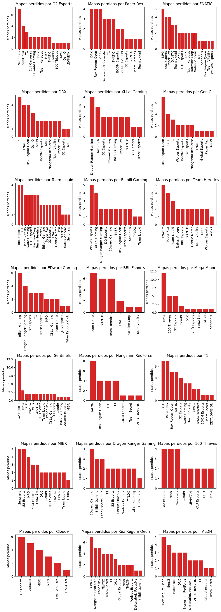
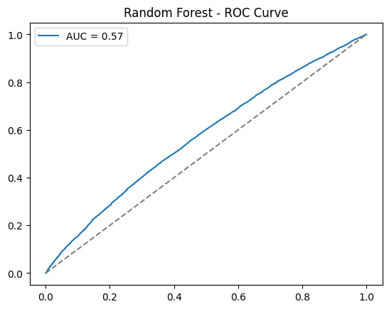
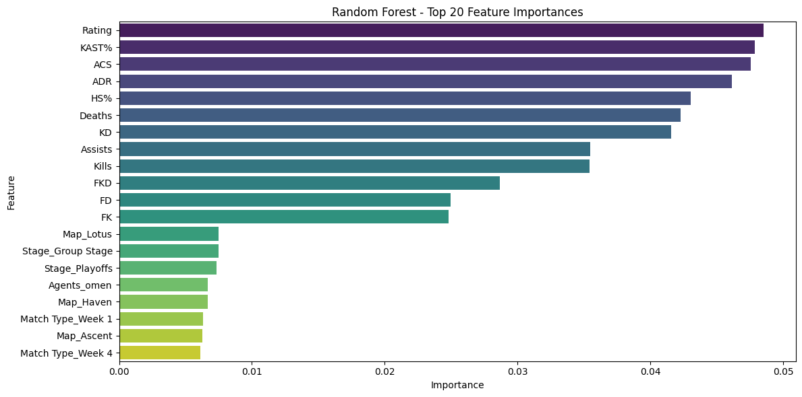

# bastianb-analytics-Valorant-Analysis-Matchs
We will analyze player statistics, such as maps played, and complete missing information in order to build a standard predictive model

# Valorant Competitive Analysis: Map-Level Performance and Match Outcome Prediction

## Table of Contents
- [Objective](#objective)
- [Dataset](#dataset)
- [Tools](#tools)
- [Key Findings](#key-findings)
- [Visualizations](#visualizations)
- [Future Work](#future-work)

## Limitations
- Player-level statistics are aggregated at the map level for simplicity.
- Agent composition is simplified and does not account for full team synergies.
- Economy and round-level data are not included in the current analysis.

These limitations were intentional to keep the analysis focused on
map-level performance and model interpretability.

## Objective
- Analyze player performance across maps
- Identify patterns in key performance metrics
- Handle missing and inconsistent real-world data

## Dataset
- Source: [VLR.gg (scraped / collected)](https://www.kaggle.com/datasets/ryanluong1/valorant-champion-tour-2021-2023-data)
- Data includes player statistics per match
- Missing values present in some matches

## Tools
- Python
- pandas, numpy
- matplotlib, seaborn
- scikit-learn (modeling, pipelines, evaluation)

## Key Findings
- Player performance varies significantly by map, particularly in ACS and Rating.
- High-winrate teams show non-random loss patterns against specific opponents.
- Advanced performance metrics (KAST%, ADR, ACS) are more predictive of map outcomes
  than raw kill counts alone.
- Missing values required careful filtering to avoid bias and data leakage.

### Opponent-based loss patterns (advanced analysis)

This visualization compares map losses by opponent for high-winrate teams.
It highlights potential counter-play styles and matchup dependencies,
and serves as a deeper exploratory analysis rather than a headline result.

**Key insights:**
- Certain opponents systematically dominate specific map pools.
- Loss distribution suggests preparation gaps rather than random variance.
- This pattern could be used to adjust veto strategies or training focus.

  ### Model performance (ROC curve)

The ROC curve evaluates the discriminative ability of the Random Forest model
to predict map-level outcomes. The model achieves a strong ROC-AUC score,
indicating good separation between wins and losses across different thresholds.

  ### Feature importance (Random Forest)

This visualization shows the top 20 most important features used by the
Random Forest model to predict map outcomes.

**Key observations:**
- Performance metrics such as Rating, ACS, KAST%, ADR and KD are the strongest
  contributors to map-level win probability.
- Contextual categorical variables (Map, Team, Opponent, Region) also play a
  significant role after one-hot encoding.
- The results align with competitive intuition: consistent round impact and
  efficiency matter more than raw kill counts alone.

This analysis improves model transparency and helps connect statistical results
with in-game performance factors.

## Future Work
- Incorporate agent composition and role-based features.
- Extend predictions to best-of series outcomes.
